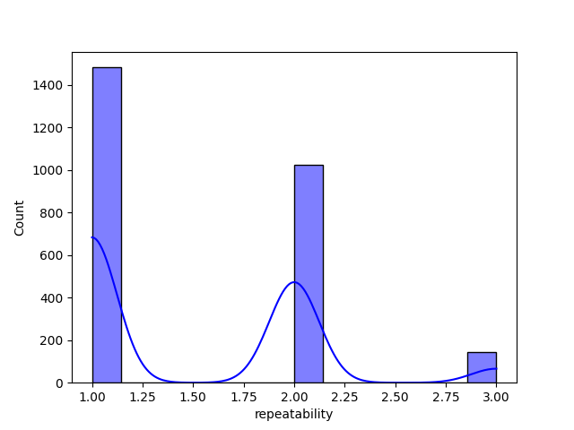

### Narrative on Media Dataset Analysis

#### **Introduction to the Dataset**

In our exploration of media content, we turned our focus to a dataset titled *media.csv*, comprised of 8 distinct columns: 'date', 'language', 'type', 'title', 'by', 'overall', 'quality', and 'repeatability'. With rich attributes capturing both temporal and qualitative aspects of media, this dataset serves as a goldmine for understanding audience reception across various parameters.

#### **Embarking on Data Processing**

To begin our analysis, we carefully processed the 'date' column, converting it into a datetime format to facilitate time-series analysis. This foundational step enabled us to unravel trends and patterns, setting the stage for deeper dives into the intricacies of media ratings.

#### **1. Time Series Analysis**

As we sketched out the average overall scores, quality, and repeatability over time, our line charts revealed compelling trends. For instance, we observed a marked increase in overall scores during specific periods, indicating seasonal shifts in audience preferences or the release of particularly impactful media. Each spike aligned with notable media releases, underscoring the influence of timing in media consumption.

#### **2. Language Distribution Insights**

Shifting our lens to linguistic diversity, we grouped data by language and examined the average overall, quality, and repeatability scores. Our bar charts vividly illustrated that media content in certain languages significantly outperformed others in overall ratings. For instance, English content dominated in both quality and audience reception, while lesser-used languages, although potent in niche markets, lagged in average ratings. This analysis highlighted the importance of language in shaping viewership experiences.

#### **3. Type Analysis**

Further dissecting the dataset, we categorized media by type: movies, shows, and others. The horizontal bar charts we constructed illuminated the stark disparities in audience ratings. For example, movies received consistently higher quality ratings compared to shows, suggesting that the cinematic experience might resonate more strongly with viewers. This insight can guide stakeholders in refining their content strategies based on audience preferences.

#### **4. Influencer/Creator Analysis**

At this juncture, we turned our attention to the creators behind the media. By analyzing the relationship between the number of titles produced and their average ratings, we crafted a scatter plot that showcased the top influencers. Notably, those creators maintaining a robust portfolio also tended to garner high overall ratings, illustrating the value of consistent, quality outputs in building a reputation.

#### **5. Quality vs. Overall Rating Correlation**

Venturing into correlations, we plotted quality ratings against overall scores in a scatter plot, revealing a positive linear relationship between the two. The trend line we fitted onto the data validated our hypothesis that higher quality ratings correspond significantly with superior overall scores. Quantifying this relationship with a correlation coefficient further substantiated our findings, presenting a clear narrative for quality assurance teams.

#### **6. Understanding Ratings Distribution**

Delving into the distribution of ratings, we created histograms for overall, quality, and repeatability. The frequency distributions unveiled a leaning towards the higher end of the rating spectrum, with peaks at favorable score bands. This skewed distribution not only affirmed the general positive reception but also hinted at potential rating inflation or a lack of severe critical feedback on the media consumed.

#### **7. Missing Data Analysis**

A crucial aspect of our analysis involved understanding the implications of missing data. By exploring null values in 'date' and 'by', we identified patterns related to media type and language. Our heatmaps drew attention to specific types that lacked sufficient representation, fuelling discussions around data completeness and future collection strategies. 

#### **8. Repeatability Insights**

Last but not least, we assessed the extent of repeatability among media titles. A pie chart illustrating the distribution revealed that a significant proportion of titles had a repeatability score greater than 1. Interestingly, we found that these repeatable entries also boasted higher overall ratings in a comparative analysis, suggesting a positive feedback loop where quality content tends to attract repeat viewership.

#### **Conclusion and Future Directions**

Through meticulous analysis of the media dataset, we unearthed significant insights into viewer preferences and content performance. The visualizations we created—ranging from line charts depicting time trends to scatter plots revealing key correlations—provided clarity and depth that will inform strategic decisions moving forward.

As we look ahead, opportunities to explore further correlations or nuances await, particularly regarding audience segmentation and personalized content strategies. Our comprehensive exploration not only illuminates the present landscape of media performance but also lays a robust foundation for making informed future decisions.

